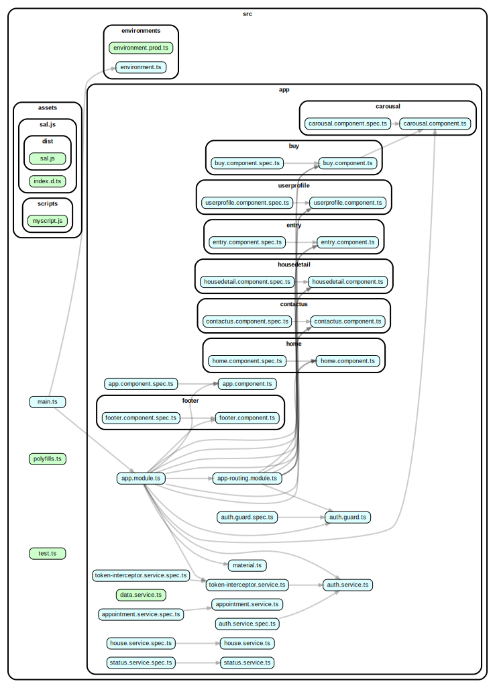

# Real Estate Website - House & Apartment Selling and Renting Website.

- We choosen this project to make ease of communication b/w house seller and buyer.
- We used angular framework for frontend and node js as server and mongodb as database.
- Why mongodb? well, as we require all house data at once querying is faster if they resides at one place. if we choose RDBMS we need to do join operation and which is costly.
- We used mapbox api for geolocation for the house and for displaying pointer on map.

## main features

- User can publish thier house for either selling or for rent.
- Buyer can place appointment on available days of seller.
- Buyer than approve for appointment.
- Searching house by place and using other filter like price amenities and number of bedroom,kitchen,bathroom.
- Designing UI - User friendly representation of house details, for that we taken reference of other real estate website that how they display house details and we taken some ideas from differnt websites and combined and created our UI.
- For getting place location we used geolocation api.

## Angular Component Structure

Made By [Priyank Chaudhri](https://github.com/pc810) and [Swar Patel](https://github.com/swarpatel23).
